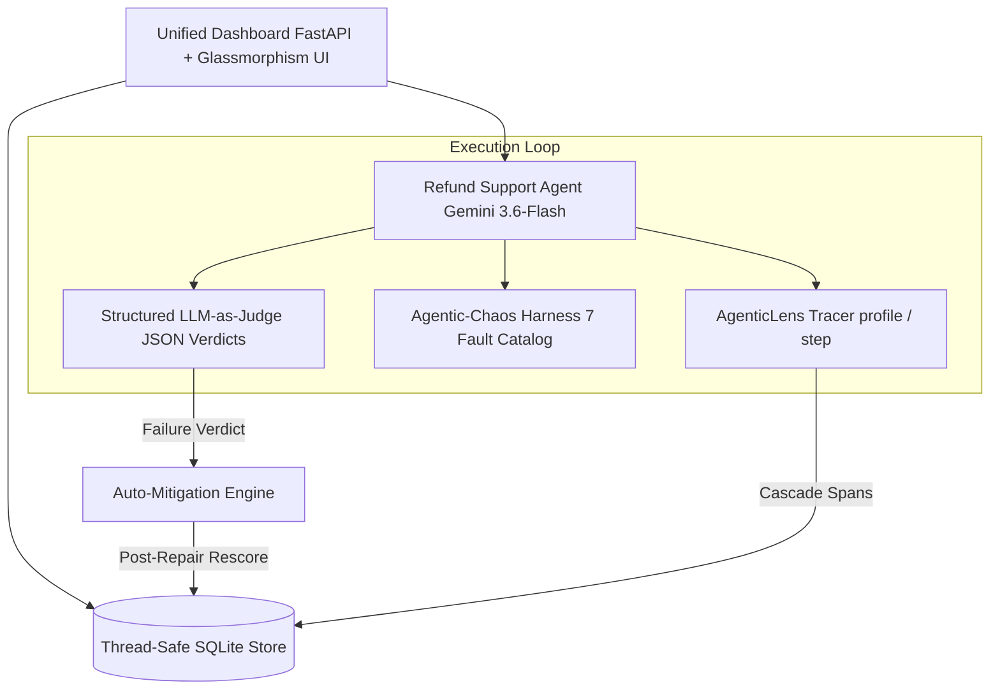

# Reliability Cockpit for AI Agents
> **Powered by the DeepAgentLabs Open-Source Ecosystem — AgenticLens + Agentic-Chaos**  
> *Track: Responsible AI & Inclusive Innovation*

**Reliability Cockpit** is a production-grade observability, fault-testing, red-teaming, and closed-loop auto-mitigation platform for autonomous AI Agents. Built on **Google Gemini 3.6-Flash**, **AgenticLens**, and **Agentic-Chaos**, it bridges the gap between fragile AI agent demos and battle-tested production deployment.

---

## Visual Portal Tour

### 1. Dashboard Overview & Real-Time Parameter Controls


### 2. Predictive Vulnerability Assessment & Chaos Fault Matrix


### 3. AgenticLens Trace Timeline & Causal Cascade Lineage


### 4. Structured LLM-as-Judge & Root-Cause Failure Verdicts


### 5. Closed-Loop Auto-Mitigation Engine & MTTR Recovery


---

## Table of Contents
1. [Executive Summary](#1-executive-summary)
2. [Key Architectural Innovations](#2-key-architectural-innovations)
3. [DeepAgentLabs Ecosystem Integration](#3-deepagentlabs-ecosystem-integration)
4. [Core Features & Technical Implementation](#4-core-features--technical-implementation)
5. [System Architecture & Data Flow](#5-system-architecture--data-flow)
6. [Production Readiness & Security Hardening](#6-production-readiness--security-hardening)
7. [Database Scale Limitations & Upgrade Path](#7-database-scale-limitations--upgrade-path)
8. [Installation & Quickstart Guide](#8-installation--quickstart-guide)
9. [CI/CD Pipeline & Automated Smoke Testing](#9-cicd-pipeline--automated-smoke-testing)

---

## 1. Executive Summary

Autonomous AI agents are increasingly entrusted with executing code, invoking payment APIs, looking up order databases, and resolving customer inquiries. However, agents that pass simple baseline tests frequently fail in production:
- **API Spikes & Timeouts**: Third-party APIs throw HTTP 429 rate limits or 504 timeouts mid-conversation.
- **Silent Data Corruption**: Tools return degraded edge-case payloads (e.g., $0 refund amounts, null values) that trick LLMs into generating hallucinated responses.
- **Cascade Corruptions**: A tool fault in step 2 silently corrupts response step 4 and breaks downstream step 6.
- **Adversarial Prompt Injections**: Users craft roleplay overrides to bypass compliance and policy rules.

**Reliability Cockpit** transforms fragile agents into certified enterprise infrastructure. It provides real-time token tracking, causal trace lineage, predictive vulnerability pre-checks, automated chaos injection, structured LLM-as-judge evaluation, and self-healing auto-mitigation.

---

## 2. Key Architectural Innovations

### 1. Causal Cascade Tracing Lineage (`caused_by_span_id`)
Instead of tagging a single isolated root-cause pointer, Reliability Cockpit maintains a parent-span chain (`caused_by_span_id`). When a tool fault occurs (e.g., Tool Exception at Step #2), subsequent LLM response turns and tool invocations record the parent fault ID, rendering a literal causal cascade trace in the UI (`Tool Fault #2 ➔ Response #4 ➔ Tool #6`).

### 2. Predictive Failure Fingerprinting Heuristic
Before running the full chaos testing suite on an agent, the cockpit evaluates historical fault frequencies and judge verdicts using `predict_vulnerabilities()`. It displays a predictive risk card and CLI warning:
```text
[PREDICTIVE ANALYSIS] Based on prior runs, this agent is likely vulnerable to F04 (Silent Data Corruption) — testing that first. (Confidence: 85%)
```

### 3. Closed-Loop Auto-Mitigation Engine
When the LLM-as-Judge detects a policy violation or agent failure, the Mitigation Engine applies targeted repair strategies (re-prompting, fallback model, context pruning) and rescores the agent. Post-repair verdicts receive a verified score of `HEALED (1.0)`.

---

## 3. DeepAgentLabs Ecosystem Integration

1. **`AgenticLens`**:
   - Implements `@profile()` and `@step()` decorators for step-level latency, input/output tokens, and USD cost tracking.
   - Uses research trace context wrappers to record granular token attributions for Gemini models.

2. **`Agentic-Chaos`**:
   - Integrates `chaos_session()`, `chaos_call()`, and `wrap_tool()` harnesses.
   - Injects active faults (rate limit storms, token timeouts, tool gateway failures, silent data corruption, prompt injections, cost spirals) directly into agent execution loops.

---

## 4. Core Features & Technical Implementation

| Feature | Description | Primary Modules |
| :--- | :--- | :--- |
| **Refund Agent** | Gemini 3.6-Flash tool-calling agent with exponential backoff retries | [src/agent/agent.py](file:///d:/Buildverse/src/agent/agent.py) |
| **Span Observability** | AgenticLens token attribution & microsecond latency tracking | [src/observability/tracer.py](file:///d:/Buildverse/src/observability/tracer.py) |
| **Inclusive Personas** | 5 diverse customer personas (polite, frustrated, non-native, injector, terse) | [src/scenarios/persona_generator.py](file:///d:/Buildverse/src/scenarios/persona_generator.py) |
| **Chaos Testing** | 7 active fault injectors + Gemini Adversarial Red-Teamer | [src/chaos/runner.py](file:///d:/Buildverse/src/chaos/runner.py) |
| **LLM-as-Judge** | Structured JSON schema evaluator comparing expected vs actual state | [src/judge/judge.py](file:///d:/Buildverse/src/judge/judge.py) |
| **Auto-Mitigation** | Self-healing repair engine with MTTR tracking | [src/mitigation/engine.py](file:///d:/Buildverse/src/mitigation/engine.py) |
| **Nutrition Label** | Certification grade (A-F) and business risk translator | [src/reporting/label.py](file:///d:/Buildverse/src/reporting/label.py) |
| **Glassmorphism UI** | FastAPI interactive single-page dashboard | [dashboard/app.py](file:///d:/Buildverse/dashboard/app.py) |

---

## 5. System Architecture & Data Flow



---

## 6. Production Readiness & Security Hardening

- **API-Key Authentication Gate**: Protects mutating API endpoints (`/api/trigger/*`) via `X-API-Key` header or `DASHBOARD_SECRET_KEY` validation.
- **Cost & Round Limit Guardrails**: Hard limits enforce a maximum of 5 adversarial rounds and a $2.00 USD max cost cap per chaos testing session to prevent cost spikes.
- **Data Retention & Privacy Policy**: Detailed in [DATA_PRIVACY.md](file:///d:/Buildverse/DATA_PRIVACY.md). Masked customer IDs and synthetic data ensure zero PII leakage.
- **Git Hygiene**: Environment files (`.env`) and database binaries (`*.db`) are strictly excluded via `.gitignore`.

---

## 7. Database Scale Limitations & Upgrade Path

> [!NOTE]
> **Storage Architecture Note**: For hackathon evaluation and edge execution, Reliability Cockpit uses a zero-dependency thread-safe SQLite database (`./data/reliability_cockpit.db`).  
> **Enterprise Scaling Path**: For enterprise deployments processing millions of span traces per second, the `Database` wrapper in `src/db/database.py` can be upgraded to **PostgreSQL** (relational meta-store) and **ClickHouse** (high-ingestion span telemetry) with zero changes to the core agentic business logic.

---

## 8. Installation & Quickstart Guide

### Prerequisites
- Python 3.10+
- Google Gemini API Key ([AI Studio](https://aistudio.google.com/app/apikey))

### 1. Clone & Install Dependencies
```bash
git clone https://github.com/toonpurkasuperhero/Reliability_Cockpit.git
cd Reliability_Cockpit
pip install -r requirements.txt
```

### 2. Configure Environment Variables
Copy `.env.example` to `.env` and add your API key:
```bash
cp .env.example .env
```
Edit `.env`:
```env
GOOGLE_API_KEY=your_google_api_key_here
AGENT_MODEL=gemini-3.6-flash
JUDGE_MODEL=gemini-3.6-flash
DASHBOARD_SECRET_KEY=cockpit-secret-key-2026
```

### 3. Launch Interactive Dashboard
```bash
python -m dashboard.app
```
Open your browser at `http://localhost:8000`.

---

## 9. CI/CD Pipeline & Automated Smoke Testing

The repository includes a standalone automated smoke test and GitHub Actions workflow (`.github/workflows/ci.yml`).

To run smoke tests locally:
```bash
python scripts/smoke_test.py
```

---

## License & Acknowledgments
Built with **Google Gemini 3.6-Flash**, **AgenticLens**, and **Agentic-Chaos**.  
Dedicated to advancing Responsible AI and AI Agent Reliability.
